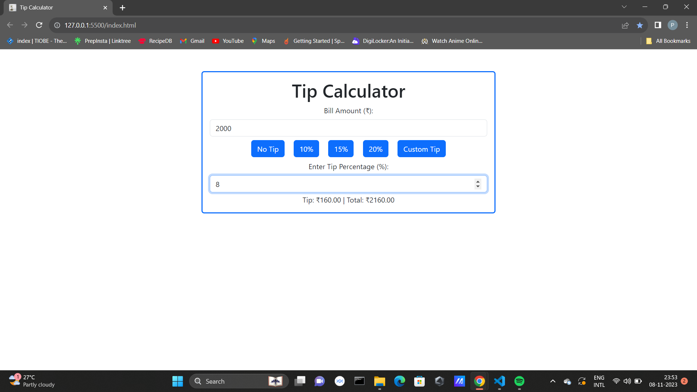

# Tip Calculator

This is a simple web-based tip calculator that allows you to quickly calculate tips based on the bill amount. You can choose from predefined tip percentages or enter a custom tip percentage.

## Usage

1. Enter the bill amount in the "Bill Amount (₹)" field.
2. Choose one of the tip percentage buttons (No Tip, 10%, 15%, 20%) or click the "Custom Tip" button to enter a custom tip percentage.
3. If you choose the "Custom Tip" option, enter the tip percentage in the "Enter Tip Percentage (%)" field.
4. The tip amount and total amount will be displayed below.

## Output


## Clone this Repository

To clone this repository to your local machine, use the following command:

```bash
git clone https://github.com/Prabakaran-MS/Tip-Calculator.git
